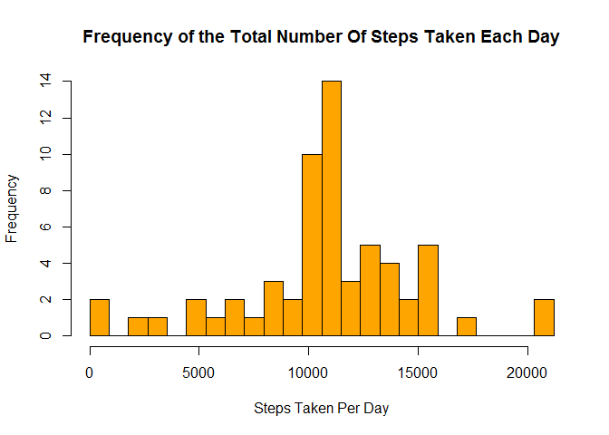

# PA 1
Matthew Kruse  
March 30, 2016  


### Step 1: Loading and preprocessing the data
#### Download and load the data into R

```r
download.file('https://github.com/matthew-kruse/RepData_PeerAssessment1/raw/master/activity.zip', 'activity.zip')
unzip('activity.zip')
sd <- read.csv('activity.csv', header=TRUE, sep=',', quote ="\"")
```

### Step 2: What is mean total number of steps taken per day?
#### Remove NA's from the dataset

```r
clean <- sd[complete.cases(sd),]
```

#### Calculate the total number of steps taken per day

```r
steps <- aggregate(clean$steps, list(clean$date), sum)
names(steps) <- c('Date', 'Steps Taken Count')
```

#### Render the histogram of steps taken

```r
max_steps <- max(steps$`Steps Taken Count`)
hist(steps$`Steps Taken Count`,
     breaks=seq(0,max_steps,l=25), 
     xlab='Steps Taken Per Day',
     ylab='Frequency',
     main='Frequency of the Total Number Of Steps Taken Each Day',
     col='orange'
)
```


#### Calculate and report the mean and median of the total number of steps taken per day

```r
steps_mean <- mean(steps$`Steps Taken Count`)
cat('Average steps per day:', steps_mean, '\n')
```

```
## Average steps per day: 10766.19
```

```r
steps_median <- median(steps$`Steps Taken Count`)
cat('Median steps per day:', steps_median, '\n')
```

```
## Median steps per day: 10765
```

### Step 3: What is the average daily activity pattern?
#### Make a time series plot (i.e. type = "l") of the 5-minute interval (x-axis) and the average number of steps taken, averaged across all days (y-axis)


```r
steps_by_period <- aggregate(clean$steps, list(clean$interval), mean)
names(steps_by_period) <- c('Interval', 'Average Steps')
plot(steps_by_period$Interval,
     steps_by_period$`Average Steps`,
     type='l',
     xlab='Time Interval',
     ylab='Average Steps',
     main='Average Steps By Time Interval'
)
```


#### Which 5-minute interval, on average across all the days in the dataset, contains the maximum number of steps?

```r
max_interval <- steps_by_period[which(steps_by_period$`Average Steps` == max(steps_by_period$`Average Steps`)), ]
cat('The interval', max_interval$Interval, 'had the highest average steps with an average of', max_interval$`Average Steps`)
```

```
## The interval 835 had the highest average steps with an average of 206.1698
```

### Step 4: Imputing missing values
#### Note that there are a number of days/intervals where there are missing values (coded as NA). 
#### The presence of missing days may introduce bias into some calculations or summaries of the data.
#### Calculate and report the total number of missing values in the dataset (i.e. the total number of rows with NAs)


```r
total_rows <- nrow(sd)
clean_rows <- nrow(clean)
dirty_rows <- total_rows - clean_rows
dirty_perc <- dirty_rows / total_rows * 100
cat('The original dataset contains', dirty_rows, 'rows with missing values or', dirty_perc, '%')
```

```
## The original dataset contains 2304 rows with missing values or 13.11475 %
```

#### Devise a strategy for filling in all of the missing values in the dataset. 
#### The strategy does not need to be sophisticated. For example, you could use the mean/median for that day, 
#### or the mean for that 5-minute interval, etc.
#### Create a new dataset that is equal to the original dataset but with the missing data filled in.


```r
corrected <- sd

for(i in 1:nrow(corrected)) {
  row <- corrected[i,]
  
  if (is.na(row$steps)) {
    row$steps <- steps_by_period[steps_by_period$Interval == 2330,]$`Average Steps`
    corrected[i,] <- row
  }
}
```

#### Make a histogram of the total number of steps taken each day

```r
c_steps <- aggregate(corrected$steps, list(corrected$date), sum)
names(c_steps) <- c('Date', 'Steps Taken Count')
```

#### Make a histogram of the total number of steps taken each day

```r
max_steps <- max(c_steps$`Steps Taken Count`)
hist(c_steps$`Steps Taken Count`,
     breaks=seq(0,max_steps,l=25), 
     xlab='Steps Taken Per Day',
     ylab='Frequency',
     main='Frequency of the Total Number Of Steps Taken Each Day',
     col='orange'
)
```



#### Calculate and report the mean and median total number of steps taken per day

```r
c_steps_mean <- mean(c_steps$`Steps Taken Count`)
cat('Average steps per day:', c_steps_mean, '\n')
```

```
## Average steps per day: 9452.575
```

```r
c_steps_median <- median(c_steps$`Steps Taken Count`)
cat('Median steps per day:', c_steps_median, '\n')
```

```
## Median steps per day: 10395
```

#### Do these values differ from the estimates from the first part of the assignment?

```r
cat('Missing Values Removed Mean Steps:', steps_mean)
```

```
## Missing Values Removed Mean Steps: 10766.19
```

```r
cat('Corrected Data Mean Steps:', c_steps_mean)
```

```
## Corrected Data Mean Steps: 9452.575
```

```r
cat('Missing Values Removed Median Steps:', steps_median)
```

```
## Missing Values Removed Median Steps: 10765
```

```r
cat('Corrected Data Median Steps:', c_steps_median)
```

```
## Corrected Data Median Steps: 10395
```

#### What is the impact of imputing missing data on the estimates of the total daily number of steps?

```r
cat('By inferring missing values, the mean decreased by', steps_mean - c_steps_mean, 'steps')
```

```
## By inferring missing values, the mean decreased by 1313.613 steps
```

```r
cat('By inferring missing values, the median decreased by', steps_median - c_steps_median, 'steps')
```

```
## By inferring missing values, the median decreased by 370 steps
```

### Step 5: Are there differences in activity patterns between weekdays and weekends?
#### Using the dataset with the filled-in missing values for this part.
#### Create a new factor variable in the dataset with two levels - "weekday" and "weekend" 
#### indicating whether a given date is a weekday or weekend day.

```r
day_of_week <- weekdays(as.Date(corrected$date))
corrected[,'dayofweek'] <- NA

for(i in 1:length(day_of_week)) {
  day <- day_of_week[i]
  
  if (day == 'Saturday') {
    wd <- 'weekend'
  }
  else if (day == 'Sunday') {
    wd <- 'weekend'
  }
  else {
    wd <- 'weekday'
  }
  
  corrected[i,'dayofweek'] <- wd
}
```

#### Make a panel plot containing a time series plot (i.e. type = "l") of the 5-minute interval (x-axis) 
#### and the average number of steps taken, averaged across all weekday days or weekend days (y-axis). 


```r
weekends <- corrected[corrected$dayofweek=='weekend',]
weekdays <- corrected[corrected$dayofweek=='weekday',]

steps_weekend <- aggregate(weekends$steps, list(weekends$interval), mean)
steps_weekday <- aggregate(weekdays$steps, list(weekdays$interval), mean)

names(steps_weekend) <- c('Interval', 'Average Steps')
names(steps_weekday) <- c('Interval', 'Average Steps')

par(mfrow=c(2,1))

plot(steps_weekend$Interval,
     steps_weekend$`Average Steps`,
     type='l',
     xlab='Time Interval',
     ylab='Average Steps',
     main='Average Steps By Time Interval On Weekends',
     col='blue'
)

plot(steps_weekday$Interval,
     steps_weekday$`Average Steps`,
     type='l',
     xlab='Time Interval',
     ylab='Average Steps',
     main='Average Steps By Time Interval on Weekdays',
     col='blue'
)
```


